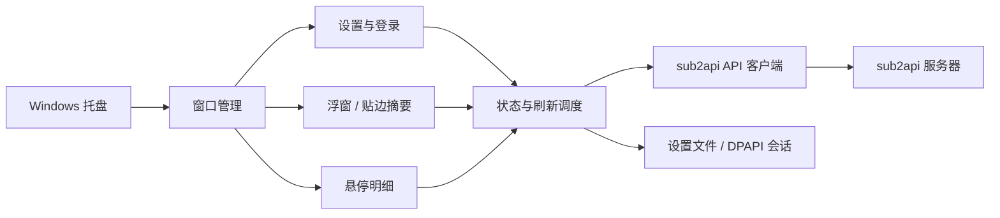

# Sub2API 桌面额度监控方案

确认日期：2026-09-28。目标平台：Windows 10/11 x64。首版名称：Sub2API Quota Monitor。技术方案：**C# / .NET 10 + WPF**，接口目标：**sub2api 0.2.8**。

## 1. 目标与范围

常驻系统托盘，通过小型置顶浮窗快速查看至少两个上游账号的 5 小时与 7 天额度。监控对象是 sub2api 接入的 Claude、OpenAI 等上游账号，不是用户钱包余额，也不使用推理 API Key 获取管理数据。

首版交付真正的桌面窗口、托盘菜单、设置、登录、账号选择和定时取数。服务器仍由用户维护，客户端调用现有读取额度与登录会话接口。客户端不直接调用推理模型；服务器的额度查询可能采用缓存和内部探测。

## 2. 已确认的界面

### 浮窗

- 每个账号一行：短名称、5 小时进度条、7 天进度条。
- 不显示大标题、窗口标题或更新时间。进度条高度 22 DIP，百分比位于条内。
- 默认显示已用比例；可在设置切换成剩余比例，条的填充长度跟随所选含义。
- 状态色始终根据实际已用额度分级：正常不超过 50%，注意大于 50% 且小于 80%，接近耗尽从 80% 开始。
- 默认颜色：正常 `#83cbaa`、注意 `#ffa600`、接近耗尽 `#ed9c98`。颜色可自定义，并预览填充与文字对比度。
- 默认单条宽度 68 DIP。两个账号、两个窗口时约 224 × 64 DIP；关闭 5 小时额度后约 150 × 64 DIP。
- 宽度随设置实时更新；账号名过长时截断并提供完整名称提示。

### 贴边摘要

- 拖动后距离当前显示器工作区的任一边不超过 20 DIP 时吸附。避开任务栏，支持多显示器、负坐标及不同 DPI。
- 顶部和底部横向排列，左右两侧竖向排列。两种摘要宽度独立设置。
- 默认横向 178 DIP、侧边 64 DIP。
- 一次显示一个账号，默认每 4 秒轮播；轮播间隔可设为 2 至 60 秒。
- 较长的账号名使用 C1、O2 等短标记，悬停提示完整名称，避免多个同名前缀无法分辨。
- 默认显示该账号最紧张的额度窗口，也可选择两个窗口或指定一个窗口。
- 悬停查看明细或拖动期间暂停账号切换，离开后重新计时。
- 支持拖离边缘恢复完整浮窗；关闭自动收起时保留完整显示。

### 焦点与透明度

浮球失焦且鼠标离开时默认不透明度为 65%；悬停、拖动、明细显示或固定查看时恢复到 100%。约 140 毫秒淡入淡出，同时适用于完整浮球和贴边摘要。明细和设置自身始终保持清晰。

设置提供「失焦时半透明」开关和 20–100% 的不透明度，实时生效并记住。关闭选项后浮球始终为 100%。

浮球和明细使用 `ShowActivated=false` 与 `WS_EX_NOACTIVATE`，悬停、轮播、后台刷新不主动抢走当前应用的输入焦点。设置窗口正常激活并接受键盘输入。

### 悬停明细

恢复已确认的详细设计：全部已选账号的名称、平台、状态、两个额度窗口、重置时间、数据来源和刷新时间。浮窗关闭 5 小时列时，明细仍保留该窗口。

明细单独使用桌面窗口，按屏幕剩余空间选择左、右、上或下方位置。鼠标在浮窗和明细之间移动不会马上关闭；点击可固定查看，关闭按钮取消固定。

### 设置与托盘

设置只从系统托盘右键菜单打开。浮窗和悬停明细不放设置按钮。

托盘提供刷新额度、显示/隐藏浮窗、设置、退出。设置包含显示、刷新、颜色、连接和账号选择。支持记住设置、浮窗位置和吸附边。

| 设置 | 默认值 | 可调范围 |
| --- | --- | --- |
| 百分比含义 | 已用 | 已用 / 剩余 |
| 显示 5 小时 | 开启 | 开 / 关 |
| 自动刷新 | 开启 | 开 / 关 |
| 刷新间隔 | 60 秒 | 5 至 3600 秒 |
| 轮播间隔 | 4 秒 | 2 至 60 秒 |
| 进度条宽度 | 68 DIP | 40 至 240 DIP |
| 横向贴边宽度 | 178 DIP | 120 至 400 DIP |
| 侧边贴边宽度 | 64 DIP | 48 至 240 DIP |
| 失焦时半透明 | 开启 | 开 / 关 |
| 失焦不透明度 | 65% | 20% 至 100% |
| 贴边摘要 | 最紧张窗口 | 最紧张 / 双窗口 / 5 小时 / 7 天 |

设置中的宽度单位 px 表示随 Windows 缩放的逻辑像素（DIP）。

## 3. 登录与凭据

填写 sub2api 服务器地址、管理员邮箱与密码，通过现有登录接口取得访问令牌。服务器返回需要双重验证时显示 6 位验证码输入，临时令牌只保存在内存，验证字段为 `temp_token` 与 `totp_code`。

登录成功后调用当前用户接口检查管理员权限，再列出上游账号，由用户选择常驻监控的账号。普通用户和普通推理 API Key 不能读取上游账号管理数据。

HTTP 请求和令牌由 .NET 服务持有，WPF 只显示用于展示的数据。密码不落盘、不写日志；退出登录或取消验证后清除会话和临时凭据。

勾选记住登录后，仅使用 Windows 当前用户 DPAPI 加密刷新令牌后落盘。访问令牌保留在内存。启动时用刷新令牌恢复会话；访问令牌过期时单次续期，刷新令牌轮换后更新加密文件。不勾选时不持久化令牌。

首版采用 DPAPI，后续可根据部署需要切换至 Windows Credential Manager。管理令牌本身有管理权限；客户端只调用读取额度与登录会话相关的接口，服务器端的专用只读令牌属于后续可选扩展。

## 4. 数据规则

- 采用 sub2api 的 `five_hour.utilization` 和 `seven_day.utilization`，保留服务端的来源与更新时间。
- 百分比显示四舍五入到整数，填充长度限制在 0% 至 100%；服务端超过 100% 的真实消耗值仍保留。
- 不支持的窗口、尚未采样的窗口、无效数值显示 `--`，不补零、不假造额度。
- 按 0.2.8 的单账号接口读取已选账号；`force` 始终为 `false`，沿用服务端缓存、被动采样和冷却策略。
- Claude OAuth / setup-token 优先被动数据，不请求新版批量接口。
- 同一时刻只执行一次刷新。自动刷新与手动刷新合并，颜色和宽度变化不重置数据刷新计时。
- 单账号失败保留其上次成功快照并标记缓存；其他账号继续更新。
- 网络错误保留旧数据与旧时间，显示错误状态；429 遵守 `Retry-After`。
- 登录、退出和连接变更使用会话版本校验，旧请求不得覆盖新会话。

## 5. 技术结构

采用 C# / .NET 10 + WPF。紧凑浮窗、明细与设置全部为 WPF 原生界面；WinForms 仅用于系统托盘和 Windows 颜色选择器。

`QuotaMonitor.Core` 负责设置验证、额度映射、API、状态色、刷新与会话调度、屏幕几何规则。`QuotaMonitor.Desktop` 负责 WPF 窗口、托盘、Win32 吸附、DPI、透明度、设置和 DPAPI 存储。后台取数为异步 HTTP，不阻塞 UI。

通过单实例互斥锁避免重复托盘。使用当前用户 DPAPI、正常 HTTPS 证书校验、原子配置写入与会话版本校验。原生坐标使用物理像素，界面宽度随 DPI 换算；恢复位置、显示器拔出或工作区变化时将浮窗移回可见区域。

## 6. 验收

1. 真实 Windows 托盘存在，右键可打开设置，关闭设置不退出程序。
2. 两账号浮窗能拖动、四边贴附、拖离恢复；多屏与任务栏工作区正确。
3. 已用/剩余切换、隐藏 5 小时、三种宽度和颜色设置立即生效并持久化。
4. 贴边摘要按账号轮播；悬停暂停，并显示全部账号明细和刷新时间。
5. 登录、可选双重验证、管理员校验、会话恢复与过期续期可用。
6. 自动与手动刷新可用，缺失窗口和失败缓存状态正确。
7. xUnit 测试覆盖 API、2FA、管理员校验、续期并发、缓存、账号切换、几何和透明度规则；原生窗口验证检查尺寸、悬停、透明度、工作区对齐和 DPAPI，并生成截图。
8. 构建产生可运行的自包含 Windows x64 应用。真实服务器、实际拖动与多显示器 DPI 联调单独记录，未进行时不标为完成。

当前交付为可执行程序和源码；安装包、签名、自动升级与开机自启留待后续。
